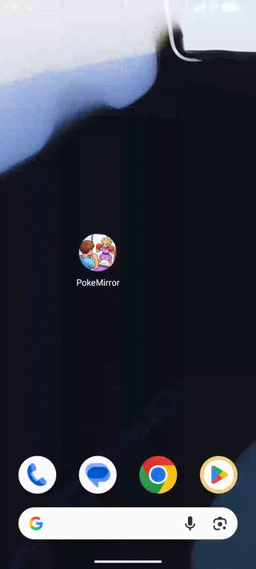

# PokeMirror : Face to Pokemon Matching (Gen 1)

<p align="center">
  
</p>

Important: This repository does not include the trained model weights. You must train the model yourself using the provided notebook or supply your own TorchScript model.


## Project Overview

PokeMirror is a mobile application that uses deep learning to match a human face, an animal or anything to the closest Pokemon from the first generation.

The application captures a photo using the device camera, processes it locally using a trained neural network and returns the Top 3 Pokemon matches along with confidence scores.

This project demonstrates a complete pipeline:
- Data preparation
- Model training
- Model export (TorchScript)
- On-device inference in an Android application


## Tech Stack

### AI / Training
- PyTorch
- Torchvision (EfficientNet-B0)
- NumPy
- PIL
- Scikit-learn
- Matplotlib

### Mobile Application
- Kotlin
- Android SDK
- PyTorch Mobile
- XML UI


## Model

The model is based on EfficientNet-B0 pretrained on ImageNet and fine-tuned on a custom dataset of Pokemon images (Generation 1).

- Input size: 224x224 (resized during preprocessing)
- Output: 151 classes (Pokemon)
- Final layer adapted for classification

The trained model is exported to TorchScript for mobile inference.

## Project Structure

```text
project-root/
├── notebook/
│   └── training.ipynb        # Training, evaluation, export
│
├── data/
│   └── images/               # Pokémon dataset (Gen 1)
│
├── mobile_code/
│   └── app/                  # Android app (Kotlin + XML)
│
├── media/
│   └── demo.gif              # Demo of the app
│
├── requirements.txt
└── README.md
```

## Installation and Usage

### 1. Model Training

Install dependencies:

pip install -r requirements.txt

Run the notebook:

notebook/training.ipynb

This will:
- Load and preprocess the dataset
- Train EfficientNet-B0
- Export the model to TorchScript


### 2. Android Application

Open the project in Android Studio:

mobile_code/

Add required files manually:
- model_mobile.pt → assets/

Run the application on a device or emulator.


## Features

- Camera capture
- On-device inference
- Top-3 predictions
- Confidence scores
- Animated UI


## Limitations

- The model is trained on Pokémon images, not human faces
- No face detection or alignment preprocessing
- Performance depends on lighting and image quality
- The background of the picture can have an impact
- Generalization to real faces is limited


## Future Improvements

- Add face detection and alignment
- Upgrade model (EfficientNetV2, MobileNetV3)
- Real-time inference with CameraX
- Multi-generation Pokémon support


## Requirements

torch
torchvision
numpy
scikit-learn
matplotlib
Pillow

## Author

Name: Grégory Jourdain  
LinkedIn: https://www.linkedin.com/in/grégory-jourdain/  
Email: g1jourda@enib.fr